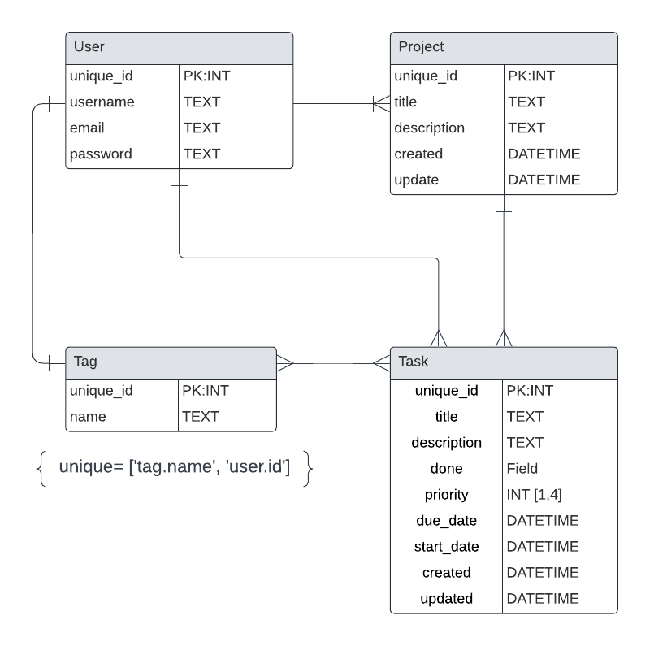

# Todux

This project is a model/example project for learning how to use [HTMX](https://htmx.org/) with [Django](https://www.djangoproject.com/). In this project I also want to implement other libraries that go hand in hand like [Alpine.js](https://alpinejs.dev/) and the use of [Django Components](https://github.com/EmilStenstrom/django-components/).

Currently the implementation only includes htmx in the CRUD of tags, projects, and task. and task CRUD, but later on I want to implement changes in the state of components based on actions in the CRUD. I want to explore hx-headers and server sent events.

By the way, the best To-Do app: [todoist](https://todoist.com/).

## Model

- User
  - Tasks
  - Projects
  - Tags



Each task can only be assigned to one project. Each task can have as many tags as you want.

## Usage and test

```sh
git clone https://github.com/zft9xgy/todux.git
cd todux
touch db.sqlite3
python manage.py makemigrations
python manage.py migrate
python manage.py runserver
```
